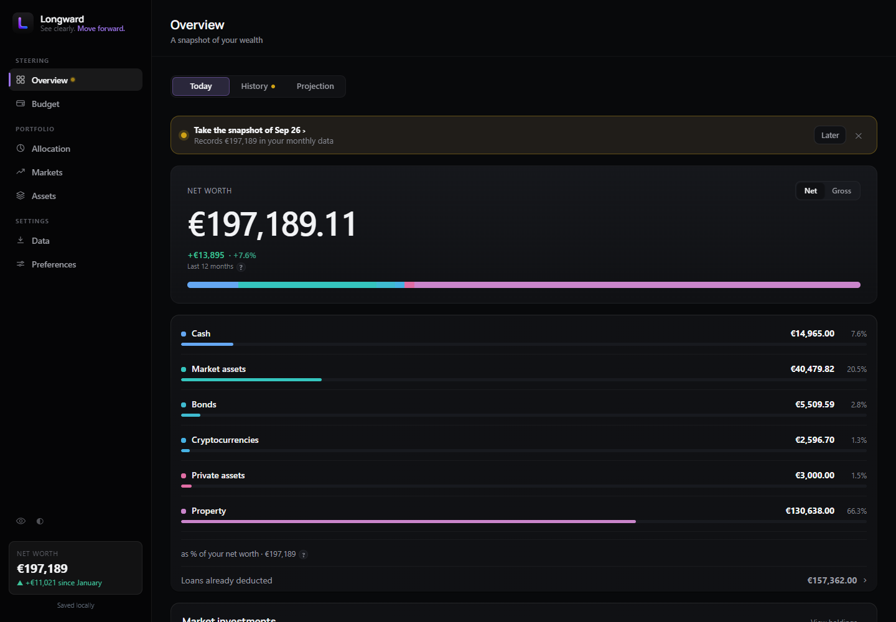
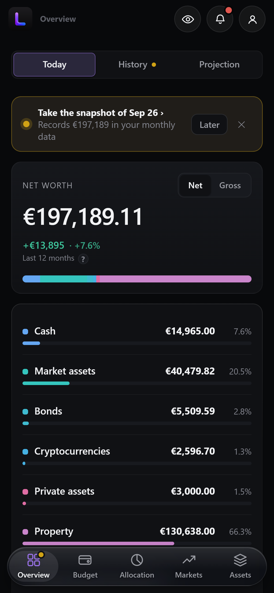
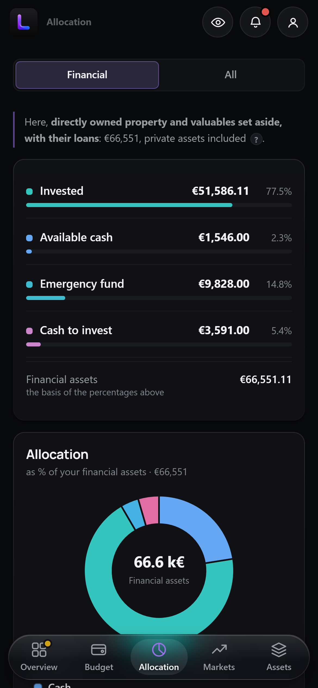
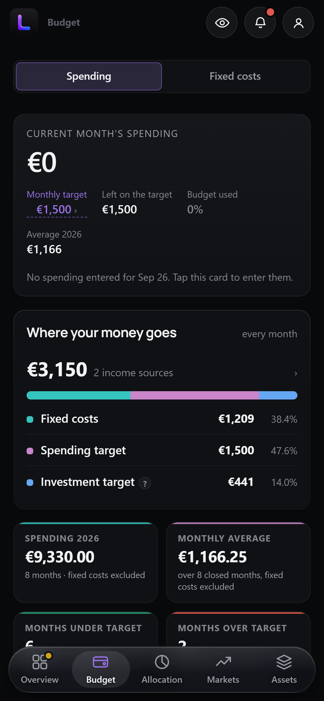
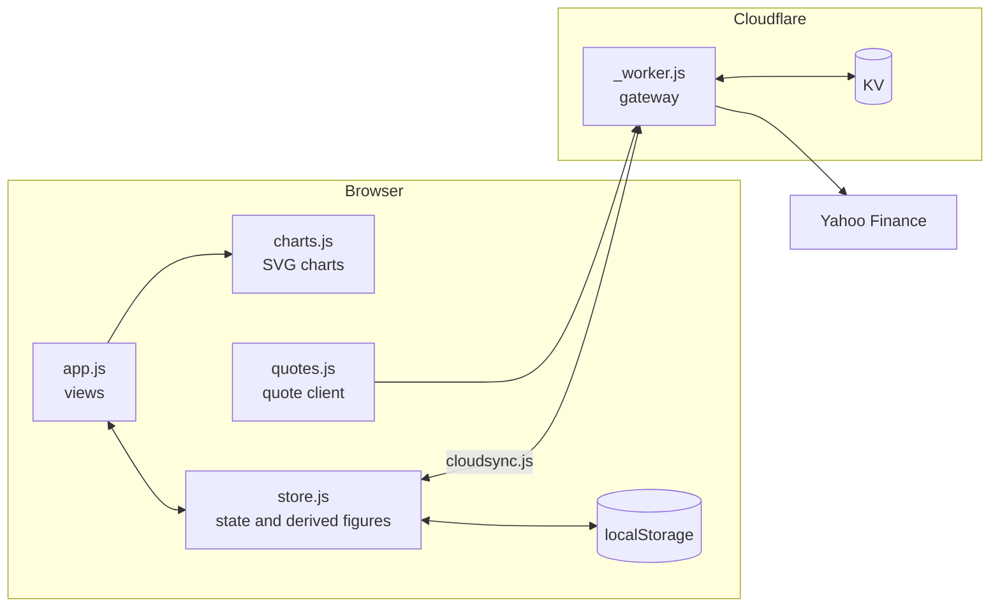

<h1 align="center">Tallya</h1>

<p align="center"><b>A personal wealth dashboard.</b> It answers three questions:<br>
how much do I have, where does it sit, and where is it going?</p>

<p align="center">
  <a href="LICENSE"></a>
  
  
  
</p>

<p align="center"><a href="https://tallya-demo.pages.dev"><b>Live demo</b></a> : fictional data, nothing to install.</p>

<p align="center">Designed and built by <b>Pierre-Louis FETET</b>.</p>

[](https://tallya-demo.pages.dev)

<p align="center">
  &nbsp;
  &nbsp;
  
</p>

Mobile-first by design: install it on a phone (PWA), use it offline, sync
across devices. No table wider than three columns ever reaches a 375px
screen; it turns into a tappable list instead.

## Engineering principles

A wealth dashboard has one job: showing numbers that are true. Four rules
govern this codebase, each one earned the hard way.

**A total equals the sum of its parts.** It sounds obvious. In practice, six
screens violated it without anything showing: percentages adding up to
98.97%, a total column missing two buckets out of five, the same label worth
two different amounts on two pages, both totals right. The numbers looked
correct and were wrong. Every derived figure is now guarded by that single
assertion.

**Missing data displays as missing, never invented.** No free source
publishes a fund's country breakdown. Rather than draw a "World, 100%" pie
for an MSCI World that is really 70% American, the geographic charts were
removed. A wrong chart is worse than no chart.

**A fact has one owner.** A loan's monthly payment lives on the fixed charge
that pays it; the loan links to the charge and reads through it. Lists are
derived from the data, never written twice. Two fields for one value means
nobody can prove they agree.

**A state is declared, not deduced.** A payment date in the past does not
mean "late": transfers routinely arrive a few days behind, and painting the
row red every month teaches the eye to ignore red. The app points, the owner
decides. The one figure that goes stale by itself, a loan's remaining
principal, gets projected and asked about, never silently overwritten.

## Tested against the defects that actually happened

Several hundred test cases, no test framework: the whole harness is
[74 lines](tests/harness.js). Open `/tests.html`, the browser tab title gives
the verdict.

Three habits make these tests worth more than their count:

- **Each suite answers a real defect.** The question behind every test is:
  which assertion would have caught this before I did?
- **Every suite was validated by breaking it.** A test that has never failed
  proves nothing, so each one was made to fail on purpose once.
- **Many tests read the source itself.** They derive the rule from the file
  instead of copying its current value, so the value someone writes tomorrow
  is already covered.

## Architecture

```
index.html         a single page, hash routing
assets/
  store.js         state, migrations, every derived figure
  app.js           views and interactions
  charts.js        SVG charts, drawn by hand
  quotes.js        market quotes client
  cloudsync.js     cross-device sync
_worker.js         gateway and access control (Cloudflare)
tests/             74-line harness, synthetic fixture, the suites
```

State lives in the browser (`localStorage`) and syncs through Cloudflare KV.
Calculation is strictly separated from rendering: `store.js` never touches
the DOM, which is what makes it testable without driving a browser.



## Minimal by design

Tallya has no build step and no runtime dependencies. The application is
plain HTML, CSS and JavaScript, served as static files.

This is a deliberate choice, not a limitation:

- **Inspectable.** The code that computes your net worth is exactly the code
  your browser runs. View-source is the audit trail.
- **Portable.** Deploying is copying files. The local server is one Python
  file using only the standard library; production is any static host.
- **Durable.** No dependency can break, deprecate, or ship a supply-chain
  surprise. The app will run unchanged in a decade.

The cost is real and accepted: charts are drawn by hand in SVG, and there is
no ecosystem to lean on. For a personal financial tool whose figures must
stay explainable, the trade is worth it.

## Features

| | |
|---|---|
| **Net worth** | Accounts, institutions, loans, gross and net, four liquidity tiers |
| **Markets** | Live quotes through a Yahoo gateway, day moves, unrealized gains |
| **Allocation** | By asset, by class, by account type, with targets and a rebalancing plan |
| **Budget** | Income, fixed charges that can be split, spending by category and month |
| **Projection** | Compound growth to a chosen horizon, in nominal and constant euros |
| **Statements** | One monthly snapshot, entered in a single dialog, feeding every curve |

## By the numbers

| | |
|---|---|
| Lines of application JavaScript | 20,000+ |
| Test cases | ~500, in 100+ suites |
| Runtime dependencies | 0 |
| Build steps | 0 |
| Pages | 1 |

## Run it locally

<<<<<<< HEAD
```bash
python serve.py
=======
## Exporter vers Excel

Deux boutons, dans **Données** (et un raccourci « ⤓ Excel » sur la page Positions) :

- **Classeur Excel** — 7 feuilles : `Positions`, `Allocation`, `Rééquilibrage`,
  `Comptes`, `Relevés mensuels`, `Dépenses`, `Charges fixes`.

Ce sont de vrais `.xlsx`, pas du CSV déguisé : montants au format monétaire €,
pourcentages en vraies valeurs numériques (donc recalculables, pas du texte),
dates reconnues comme dates, en-tête figé et filtres automatiques. Ils s'ouvrent
dans Excel, LibreOffice et Google Sheets sans avertissement ni assistant d'import.

Le générateur (`assets/xlsx.js`) écrit lui-même l'archive ZIP et les XML du format
OpenXML — aucune bibliothèque externe, l'app reste utilisable hors ligne.

**L'Excel est un export, pas un aller-retour** : le réimporter ne remet rien à jour.
Pour sauvegarder et restaurer, c'est le JSON.

## Le rapprochement épargne / patrimoine

L'onglet Budget calcule ton **épargne théorique** : revenus − charges fixes −
dépenses moyennes de l'année. Il la compare à la **croissance réelle** de ton
patrimoine, mesurée sur l'historique de l'onglet Historique.

Les deux chiffres ne coïncident jamais exactement, et c'est normal : la
performance des marchés et les apports non salariaux (Plateforme C, PK) creusent
l'écart. Un écart **positif** signifie que ton patrimoine grandit plus vite que
ce que ton salaire seul explique. Un écart durablement **négatif** signale une
fuite : dépenses sous-déclarées, ou charges oubliées dans le budget.

## Comment ça marche

- **Tout est éditable en place.** Tu tapes dans une case, la valeur est
  enregistrée immédiatement ; les totaux se recalculent quand tu quittes le champ.
- **Une seule source de vérité.** Un compte titres est calculé à partir des
  positions qu'il porte — pas de double saisie. Les autres comptes se saisissent
  dans **Comptes**, ou dans **Positions** pour le cash qui y dort.
- **Valeur calculée ou manuelle.** Par défaut `valeur = quantité × cours × FX`.
  Coche « Man. » pour saisir directement la valeur et le montant investi
  (c'est le cas de l'or, dont le cours affiché ne correspond pas au support détenu).
- **Le bouton ⤒** en tête de chaque ligne du relevé mensuel y recopie tous les
  montants actuels. Tant que le mois en cours n'est pas enregistré, une pastille
  rouge apparaît dans le menu et un rappel s'affiche sur la vue d'ensemble.
- **Thème clair / sombre** via le bouton en bas de la barre latérale.

## Google Drive : ce qui marche et ce qui ne marche pas

**Drive n'héberge pas de site web.** Y déposer `index.html` ne le rend pas
ouvrable comme une app : Drive affichera le code source, et le serveur des cours
ne tournera pas. Google a supprimé l'hébergement web depuis Drive en 2016.

En revanche Drive sert à deux choses réelles :

**1. Synchroniser tes données entre PC.** Onglet Données →
**« Synchroniser avec un fichier »** → choisis un `.json` dans ton dossier Google
Drive. L'app y réécrit tes données à chaque modification, Drive Desktop les
emporte, et sur l'autre PC l'app détecte que le fichier est plus récent et te
propose de le charger. Si les deux versions ont divergé, elle demande laquelle
garder — jamais d'écrasement silencieux.

**2. Synchroniser l'app elle-même.** Mets tout le dossier `Dashboard wealth`
dans Drive : tes autres PC récupèrent les fichiers et peuvent lancer le `.cmd`.
Attention, ça ne synchronise **que le code**, pas tes données — celles-ci vivent
dans le navigateur, d'où le point 1.

> Ce que Drive ne résoudra pas : **l'accès depuis le téléphone**. Un téléphone ne
> peut pas exécuter `serve.py`. Pour le téléphone, c'est
> `Lancer-Dashboard-Telephone.cmd` avec le PC allumé.

🔒 Un `.json` synchronisé contient **tout ton patrimoine en clair** et part sur
les serveurs de Google. C'est ton choix à faire en connaissance de cause : au
sens du RGPD tu en restes responsable, et un dossier Drive partagé par erreur
expose tout. Si tu préfères le garder local, l'export JSON manuel sur une clé
USB fait le même travail.

## Où sont mes données ?

Dans le `localStorage` de **ce navigateur, sur cette machine**. Rien n'est envoyé
nulle part. Deux conséquences :

1. Vider les données de navigation efface le tableau de bord → **exporte
   régulièrement le JSON** depuis l'onglet Données.
2. Pour retrouver tes données sur une autre machine ou un autre navigateur :
   exporte le JSON ici, importe-le là-bas.

### RGPD

Ces chiffres sont des **données à caractère personnel** te concernant. Elles
restent locales par défaut. Si tu exportes un fichier JSON ou CSV, tu en deviens
responsable : évite de le déposer sur un service tiers non maîtrisé ou de
l'envoyer par e-mail non chiffré, et supprime les exports dont tu n'as plus
besoin (minimisation et limitation de conservation).

## Structure

```
Dashboard wealth/
├── DEPLOY.md                    guide de mise en ligne Cloudflare
├── _worker.js                   Cloudflare Pages : cours, ISIN, recherche, état, mot de passe
├── _headers                     en-têtes de sécurité pour Cloudflare Pages
├── Lancer-Dashboard.cmd           double-clic : serveur + navigateur
├── Lancer-Dashboard-Telephone.cmd double-clic : accès depuis le téléphone (même Wi-Fi)
├── serve.py                     serveur local + passerelle cours de bourse
├── index.html                coquille + navigation
├── README.md
└── assets/
    ├── styles.css      thème clair/sombre, cartes, tableaux
    ├── seed.js         données patrimoine importées du Google Sheet (1er lancement)
    ├── seed-budget.js  données budget & dépenses importées du 2e Google Sheet
    ├── store.js        état, persistance, tous les calculs dérivés
    ├── charts.js       graphiques SVG (aire empilée, donut, barres, sparkline)
    ├── xlsx.js         générateur de fichiers Excel (ZIP + OpenXML, sans dépendance)
    ├── quotes.js       client des cours (parle à serve.py)
    ├── cloudsync.js    synchronisation entre appareils (Cloudflare KV)
    └── app.js          rendu des vues et interactions

tests.html             lanceur ; ouvre-le, le titre de l'onglet dit le résultat
tests/
    ├── harness.js      assertions et exécution, sans dépendance
    ├── fixture.js      un patrimoine synthétique de 138 250 €
    └── store.tests.js  plusieurs centaines de tests sur le calcul et la source
>>>>>>> principal/main
```

Then open `http://localhost:8765`. The one-file server serves the app and
proxies market quotes, which browsers cannot fetch directly for CORS
reasons. The test suite lives at `http://localhost:8765/tests.html`.

## Built with Claude, kept honest by the harness

Most of this repository's 400+ commits are co-authored with Claude,
Anthropic's coding agent. That is not the interesting part. The interesting
part is what it takes to trust the result: deciding what is true, checking
every displayed figure against reality, and turning each defect into a rule
plus a test so it cannot come back. The engineering principles above are
that harness. AI writes much of this code; the tests are why the numbers
can be believed.

## Hosting

Cloudflare Pages on the free tier: a dozen requests per visit against a
hundred-thousand-per-day cap.

## Author

Tallya is designed, built and maintained by **Pierre-Louis FETET** : the data
model, the engineering rules above, and every product decision behind them.

## License

AGPL-3.0, copyright © 2026 Pierre-Louis FETET. Any modified version served to
users must publish its source.
